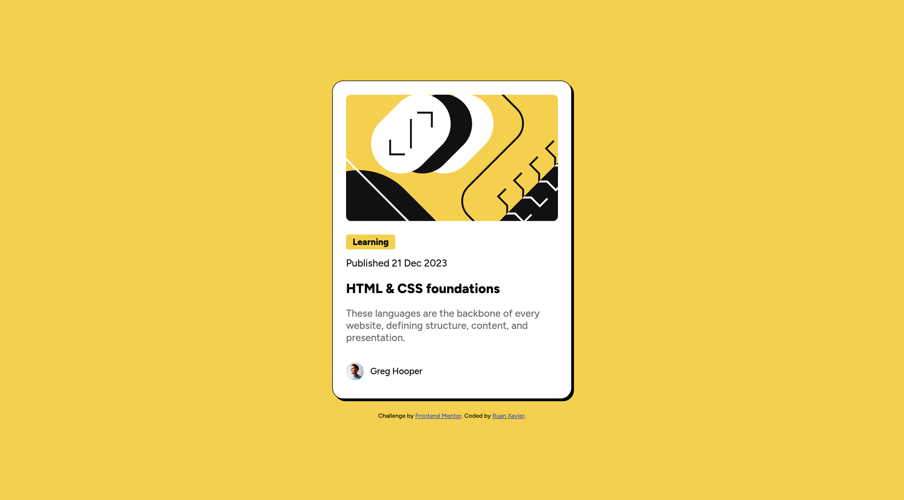
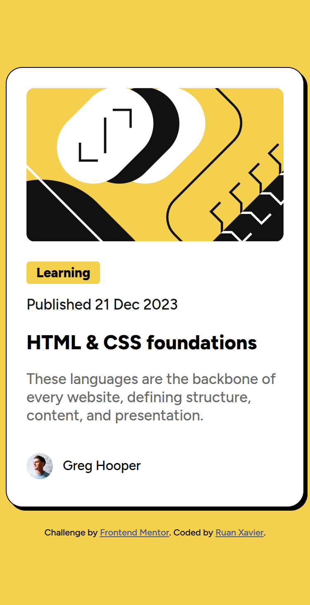

# Frontend Mentor - Blog Preview Card

Esta é uma solução para o [desafio do Blog Preview Card no Frontend Mentor](https://www.frontendmentor.io/challenges/blog-preview-card-ckPaj01IcS).

## Visão geral

### O desafio

O objetivo é criar um card de pré-visualização de blog responsivo, seguindo um design moderno e estruturado. O card deve conter:
- Uma imagem ilustrativa no topo;
- Uma categoria destacada;
- Data de publicação;
- Título do artigo;
- Breve descrição do conteúdo;
- Autor do artigo com foto de perfil.

### Captura de tela

### Links

- URL da solução: [https://github.com/ruan-xavier/blog-preview-card](https://github.com/ruan-xavier/blog-preview-card)
- URL do site ao vivo: [https://cartao-de-preview-blog.netlify.app/](https://cartao-de-preview-blog.netlify.app/)

## Meu processo

### Construído com

- HTML5 semântico
- CSS3 (Flexbox e variáveis CSS)
- Google Fonts (Figtree)

### O que aprendi

Neste projeto, aprendi a:
- Criar um layout responsivo e bem estruturado usando `flexbox`;
- Utilizar variáveis CSS para padronizar cores e espaçamentos;
- Melhorar a semântica do HTML para acessibilidade;
- Trabalhar com espaçamento, tipografia e alinhamento para um design mais refinado.

## Autor

- Frontend Mentor - [@ruan-xavier](https://www.frontendmentor.io/profile/ruan-xavier)
- GitHub - [ruan-xavier](https://github.com/ruan-xavier)
- YouTube - [@RuanHenriqueXavier](https://www.youtube.com/@RuanHenriqueXavier)